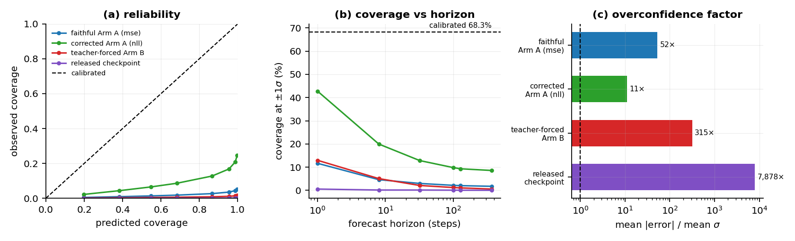
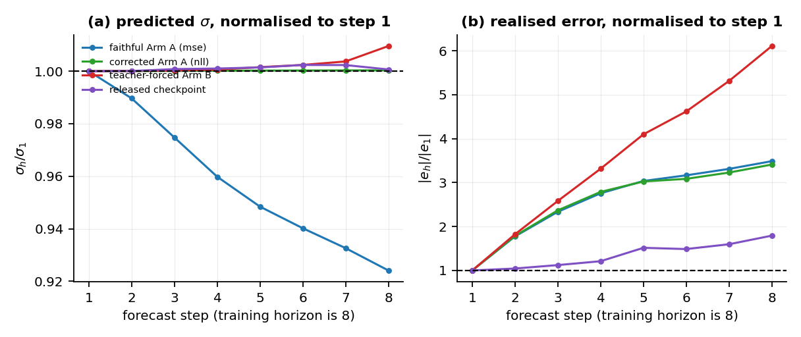
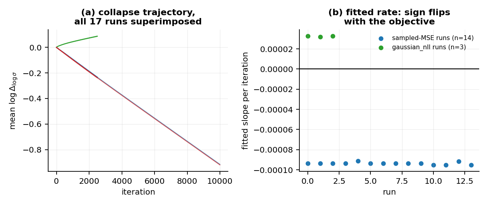
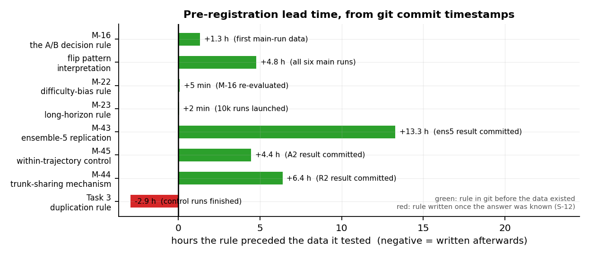
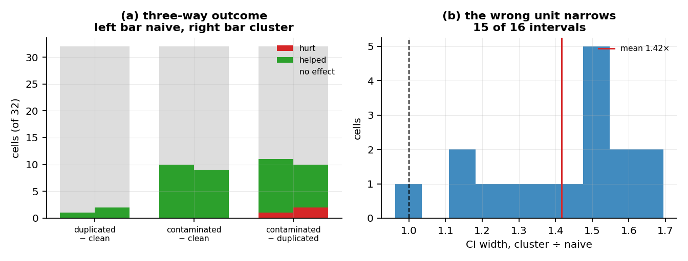

<!-- GENERATED FILE — do not edit.
     Prose lives in PAPER.template.md; every number is substituted from
     results/paper_numbers.json by scripts/build_paper.py. Edit the template,
     then run: python scripts/build_paper.py
     95 values substituted from 17 artifacts. -->

# What a world model's uncertainty output actually reports: an independent reproduction of the Robotic World Model

**Joyjeet Singh**

---

## Abstract

We independently reproduce the proprioceptive dynamics model of Li, Krause and Hutter
(*Robotic World Model*, arXiv:2501.10100) and its uncertainty-aware follow-up
(arXiv:2504.16680), building the model from scratch on CPU and verifying it against the released
reference at the level of outputs, losses and gradients before training anything.

The base paper's central claim reproduces, and by a wide margin: trained autoregressively, the
model reaches normalised error 0.3509 at a 368-step horizon on held-out episodes against
1.5540 for teacher forcing, a factor of 4.4×, with a bootstrap interval of
[0.56, 2.05] excluding zero and the gap positive on all
10 of 10 episodes. That verdict was fixed by a decision
rule committed to git before the runs that tested it existed.

The follow-up's uncertainty output does not survive contact with a calibration measurement. The
released checkpoint's predicted standard deviation is **7,878× smaller than its own
mean absolute error**, giving 0.56% coverage at ±1σ where a calibrated Gaussian gives
68.3%. We show analytically why: the state loss is squared error on a reparameterised sample with
no log-σ term, minimised at σ = 0, and the bound term that should oppose this cancels
algebraically. We then run the correction — the authors' own unused `gaussian_nll` branch — and it
fails differently rather than succeeding, reaching 10.9× overconfidence.

Measuring all four models we trained or scored puts the failure precisely. The teacher-forced arm
has the most input-dependent σ (15.6× the autoregressive arm's) and the
strongest σ-versus-error ordering (45 of 45 dimensions positive,
P = 5.68e-14), and is still 315× overconfident. These models can learn *which*
predictions will be worse. They cannot learn *how wrong* they will be. A downstream user who needs
a ranking may be served; one who needs an interval is not, under any of the four.

We also report four defects in the released pipeline, evidence that the released checkpoint cannot
have come from the released recipe, and four retractions of our own claims. Every number in this
paper is generated from a file in `results/`; none is typed by hand.

---

## 1. Introduction

A world model that reports its own uncertainty is more useful than one that does not, and the
uncertainty-aware Robotic World Model reports one. This paper asks what that number means.

We came to the question sideways. Our aim was an ordinary reproduction: rebuild the proprioceptive
dynamics model from scratch, check it against the released implementation, and see whether the
paper's central training claim holds. It does. But the same rebuild made a second question cheap
to ask, because we had a from-scratch model, the released checkpoint, and a harness that could
score both: *is the predicted σ calibrated?* It is not, by three to four orders of magnitude, and
the reason is structural rather than incidental.

Three things distinguish this from a re-run of the authors' code.

**We rebuilt rather than imported.** The forward pass, the loss and the training step are written
from scratch and then checked against the reference: outputs match bitwise, and losses and
gradients match to 0.000e+00 across 7 loss terms and
106 parameter tensors before any training begins
(Appendix A). A discrepancy found later is therefore a property of the method, not of our wiring.

**Decision rules were committed before the data.** The verdicts below were fixed in advance, in
git, with timestamps a reader can check (§7, Figure 4). One of them returned "cannot be settled"
and we report that too.

**We retract our own findings when they fail.** Four claims in this work are withdrawn on evidence
this project produced, and the retractions are kept in the record rather than deleted. One of them
concerns the pre-registration discipline itself.

---

## 2. Setup

**Data.** The released dataset is 10,000 rows of ANYmal D proprioceptive state and policy
actions at 50 Hz. It is not one recording: it is ten concatenated 20-second episodes, and its
termination column is identically zero, so nothing in the file marks the boundaries. The reference
window builder therefore treats every 9,961 window as valid, including 352 that
splice one episode's end onto the next one's start. The usable, episode-respecting count is
9,609 — 10,000 rows, less 39 that cannot start a full window, less
352 that cross a boundary. The contamination rate is 3.53%.

**Model.** A GRU-based ensemble predicting the next proprioceptive state, with a mean head and a
bounded log-σ head, plus auxiliary heads for contact and termination. The paper describes two loss
terms; the implementation has 7.

**Evaluation.** Two arenas, held separate throughout: *out-of-sample*, the two episodes withheld
from training, and *in-sample*, the eight used for it. We report both, because the released
evaluation draws its trajectories from training data and the distinction is invisible in the
original.

**Effective sample size.** Trajectory count is not sample size. Two 400-step trajectories whose
spans overlap are not independent evidence, and the out-of-sample arena contains only
4 mutually non-overlapping 400-step trajectories. Every interval in this paper is a
bootstrap over independent trajectories, and every table reports that count.

---

## 3. The base paper's central claim reproduces

**Claim under test.** Training the dynamics model on its own autoregressive rollouts beats
training it with teacher forcing, at deployment horizons.

**Rule, committed in advance** (commit `efc35b8`, and it names conditions rather than outcomes).
Three conditions, all required: the out-of-sample gap at h = 368 excludes zero
under a bootstrap over independent trajectories; the sign is consistent across episodes; and the
effect survives at 10,000 iterations rather than only at the paper's 2,500.

**Result.** All three hold: True, True, True. At h = 368 out-of-sample after
10,000 iterations, autoregressive training reaches **0.3509** against teacher forcing's
**1.5540** — a factor of **4.4×**, gap 1.2033, 95% bootstrap interval
[0.56, 2.05], on n = 4 independent trajectories. The per-episode gap
is positive on **10 of 10** episodes.

**What does not hold, and we say so.** At h = 8 — the horizon the model is trained on — the same
comparison out-of-sample gives a gap of 0.008 whose interval includes zero
(False). The advantage is a long-horizon phenomenon. An earlier rule of ours, anchored
at h = 8, returned "cannot be settled"; anchoring a rule to the horizon the claim is actually
about was a correction we had to make in advance of the runs, not after them (§7).

*Figure 5(a)* summarises the per-cell outcome across arenas, horizons and metrics.

---

## 4. The uncertainty output is unusable, and that is a property of the objective

### 4.1 The measurement

For each model we compute the mean predicted σ, the mean absolute realised error, and the fraction
of realised errors falling inside ±1σ. A calibrated Gaussian puts 68.3% inside ±1σ.

| model | mean \|error\| / mean σ | coverage at ±1σ, h=1 | coverage at h=368 |
|---|---|---|---|
| faithful Arm A (sampled MSE) | 52.2× | 11.67% | 1.75% |
| corrected Arm A (`gaussian_nll`) | 10.9× | 42.78% | 8.57% |
| teacher-forced Arm B | 315× | 12.96% | 0.56% |
| released checkpoint | 7,878× | 0.56% | 0.04% |

Every model is overconfident by between one and four orders of magnitude (Figure 1).

### 4.2 Why: the optimum is σ = 0

The state loss is squared error on a *sample* drawn from the predicted Gaussian, not a likelihood:

    L = E[(μ + σ·ε − y)²] = (μ − y)² + σ²

which is minimised at σ = 0 for any μ. There is no log-σ term to oppose it. The bound term that
appears to oppose it does not, because `max_logstd` is not an independent parameter — it is
constructed as `min_logstd + exp(log_delta_logstd)`, so

    mean(max_logstd) − mean(min_logstd) = mean(exp(log_delta_logstd))

and `min_logstd` cancels algebraically, taking no gradient from that term. The floor the interval
closes onto therefore freezes while the interval closes: a one-way ratchet.

We predicted the collapse from this algebra before training, then observed it. Across all
17 runs the collapse is linear in iteration count and its rate is nearly identical
(Figure 3a). Under the corrected objective the sign flips (Figure 3b) — which is the strongest
evidence that the mechanism is the objective and not the optimiser, the data or the architecture.

### 4.3 The correction fails differently rather than succeeding

The reference contains an unused `gaussian_nll` branch. Running it reverses the collapse and
improves the magnitude from 52.2× to 10.9× overconfident. It does not
produce a usable estimate, and it destroys something the faithful arm had: the σ-versus-error
ordering falls from 39/45 dimensions positively correlated
(P = 5.42e-07) to 21/45 (P = 7.66e-01, chance).

### 4.4 The failure is one of magnitude, not of ordering

Measuring the teacher-forced arm — which we had trained for §3, and which our own first three
calibration tables omitted — sharpens the finding:

| model | σ variation across inputs (CoV) | dims with r(σ, error) > 0 | P |
|---|---|---|---|
| faithful Arm A | 0.0076 | 39/45 | 5.42e-07 |
| corrected Arm A | 0.0059 | 21/45 | 7.66e-01 |
| **teacher-forced Arm B** | **0.1188** | **45/45** | **5.68e-14** |
| released checkpoint | 0.0177 | 20/45 | 5.51e-01 |

Arm B's σ is 15.6× more input-dependent than the faithful arm's, and its
ordering is the strongest of the four by a wide margin (mean r = 0.257). It is still
315× overconfident.

So σ collapsing to a constant is a property of the *autoregressive* arms and the released
checkpoint, not of the objective in general — and input-dependence and correct ranking are both
achievable without the interval becoming meaningful. **The failure is specifically magnitude
calibration.**

### 4.5 The structural excuse does not survive

One could argue that a model trained on an 8-step horizon cannot be expected to report calibrated
uncertainty about step 368. It cannot report it about step 8 either. Inside the trained horizon,
σ is flat while error grows (Figure 2):

| model | σ growth, step 1 → 8 | error growth, step 1 → 8 |
|---|---|---|
| faithful Arm A | 0.9241× | 3.49× |
| corrected Arm A | 1.0003× | 3.41× |
| teacher-forced Arm B | 1.0096× | 6.11× |
| released checkpoint | 1.0007× | 1.79× |

The faithful arm's σ *declines* (0.9241×) while its error grows
3.49×. The coverage collapse in Figure 1(b) is therefore driven entirely by
growing error against a fixed σ.

---

## 5. Defects in the released pipeline

**5.1 Ten unmarked episode boundaries.** §2. The window builder reads a termination column that is
identically zero, so it marks all 9,961 windows valid.

**5.2 Training and evaluation disagree on action alignment, and evaluation is the broken one.**
Row *t* holds the action that *produced* state *t*. The training path pairs states and actions
index-for-index, which is causally correct. The evaluation path feeds the action from *t−1* to
predict state *t* — stale by one step. Scored correctly the released checkpoint is materially
better than its own released evaluation reports.

**5.3 No held-out evaluation.** Evaluation trajectories are drawn from training data. For the
released checkpoint, trained on the entire file, no held-out measurement is possible at all.

**5.4 What the spliced windows cost: nothing measurable.** We trained a contaminated arm on
7,882 windows — the clean 7,687 plus 195 splices — and,
because that confounds *content* with *count*, a duplication control adding the same
195 windows as exact copies of windows already present.

The arm's contamination rate is 2.47%, against the reference pipeline's
3.53%. It is deliberately lower: we splice only boundaries whose *both* sides are
training episodes, because four of the reference's nine put held-out rows into training. That is a
leakage problem rather than a physics one, and including it would have invalidated our own
comparison. So this experiment measures the cost of training on physically impossible transitions,
and not the reference's full exposure.

Training loss over the final 250 iterations: duplication costs 0.90%, splicing costs
21.57%. The bootstrap interval on duplicated − clean is
[-0.0061, 0.0215], including zero. So the rise is caused by splice content, not by
dataset size — a control we ran only because the first version of this finding inferred the
mechanism without it.

In rollout, across 32 cells (two arenas × two trajectory lengths × two checkpoints × two
horizons × two metrics), contamination hurts in **0** of 32 and
helps in 9 (Figure 5a). The control is inert, differing from clean in
2 cells. **The unmarked boundaries remain a real defect on leakage grounds;
what is now measured is that the physically-impossible-transition component costs nothing
detectable at this rate.**

---

## 6. The released checkpoint cannot have come from the released recipe

The collapse rate is a clock. Fitting it across our runs and extrapolating to the released
checkpoint's σ state implies **153,270** optimisation steps at the configured learning
rate. The refit from our 10,000-iteration runs gives 158,319 and 158,003,
spreading 3.3% across the three fits — a linear extrapolation
validated over a fourfold extension.

The released configuration says 500 iterations. The paper says 2,500. The checkpoint is tagged
5,000. A second, independent parameter on a slower gradient path implies the same order. And under
`gaussian_nll` the implied count is *negative*, which identifies the branch the checkpoint was
trained with.

---

## 7. Method

**An append-only ledger.** Every claim in this work has a permanent identifier, an evidence class
(source, data, run, external, inference) and a status, in `FINDINGS_LEDGER.md`
(154 entries). Claims are never edited in place. A claim that turns out to be wrong is
marked superseded, with a pointer to what replaced it, and kept.

**Pre-registration, and one failure of it.** Decision rules were committed to git before the data
that tested them — with one exception, which we report below. Figure 4 shows the lead time for
each, computed from commit timestamps: the A/B rule by 1.3 hours, the flip-pattern rule by
4.8 hours, the difficulty-bias rule by 5 minutes, the long-horizon rule by 2 minutes.

The fifth bar is negative. The rule for the duplication control (§5.4) was stated in conversation
before the runs but reached git **2.9 hours after the runs finished**, and we found this only by
auditing our own `git log`. The measurement stands — the arm was built and run without reference
to its outcome — but the claim that it was pre-registered does not, and we withdraw it. We report
it because a discipline that is only checked when it succeeds is not a discipline.

**Four retractions on our own evidence.** An aggregation artifact inverted a published-model
comparison in our favour, and we withdrew it when the gating checks we had written refuted it. A
per-dimension comparison turned out to be unmatched. The claim that σ is input-independent "in all
four models" was made against a table holding three. And the pre-registration claim above.

**A statistic that was resampling the wrong unit.** Our bootstrap pooled three training seeds over
a shared set of evaluation trajectories and resampled the pooled vector, while reporting the
independent-trajectory count. Each trajectory appeared three times. Resampling trajectories
correctly — carrying all seeds with each draw — widens intervals by a mean factor of
1.42× (range 0.96–1.69) and changes 1 of
16 verdicts, in an h = 8 cell already recorded as unresolvable. Every long-horizon
verdict survives. Both units are reported.

**Reproducibility.** `./reproduce.sh --quick --force` regenerates 19 artifact files and
4,804 numeric values from a clean clone, 4,804 of them bitwise identical
(100.00%), 0 differing. Timing fields and one whole host-measurement artifact
are excluded and reported separately.

---

## 8. Limitations

**Effective sample size bounds every long-horizon claim.** The out-of-sample arena has
4 independent 400-step trajectories. That is the binding constraint on §3, and no
amount of trajectory oversampling changes it.

**Ensemble size.** Our main experiment runs at ensemble size 1 against the reference's 5, for CPU
budget. The epistemic component of the released model's uncertainty is therefore not reproduced;
§4 concerns the aleatoric head, which is per-member.

**One dataset, one gait, one terrain.** All commands are drawn from one bounded box and the gait
is a single trot throughout. "Generalisation" here means across velocity commands, not across
gaits or terrain.

**Two of our headline analyses rest on a single training seed**, because only one
10,000-iteration run per arm exists. This is recorded in the artifacts themselves.

**We did not reproduce the policy-learning results** of either paper. This is a dynamics-model
reproduction only.

---

## 9. Conclusion

The Robotic World Model's central training claim reproduces, and the margin is large. Its
uncertainty output, in the follow-up that adds one, does not report what a reader would take it to
report: the released checkpoint's σ is 7,878× smaller than its own error, and the
cause is that the objective's optimum is σ = 0 with the term that should prevent this cancelling
out of the gradient.

The more useful finding is the one that required training a model nobody had measured. Ranking and
input-dependence are achievable — the teacher-forced arm has both — while the interval remains
meaningless. Uncertainty in this family of models should be reported as an ordering, or fixed at
the objective, but not read as a scale.

---

## Data and code

`https://github.com/joyjeet-singh/rwm` — every number above cites a file under `results/`, and
`FINDINGS_LEDGER.md` carries the full claim record including the retractions. Neither upstream
repository is redistributed; `setup.sh` fetches both at pinned commits and verifies two SHA-256
hashes.

## References

1. C. Li, A. Krause, M. Hutter. *Robotic World Model: A Neural Network Simulator for Robust Policy
   Optimization in Robotics.* arXiv:2501.10100, 2025.
2. C. Li, A. Krause, M. Hutter. *Uncertainty-Aware Robotic World Model Makes Offline Model-Based
   Reinforcement Learning Work on Real Robots.* arXiv:2504.16680, 2025.

## Appendix A — verification chain

What every downstream number rests on. Each level was passed before the next was attempted.

| level | claim | result |
|---|---|---|
| shapes | parameter counts match the reference | exact |
| wiring | inference outputs match the reference module | **0.000e+00**, bitwise |
| indexing | the harness feeds the actions it claims | bitwise against the raw CSV |
| residual | the zero-delta model is the hold-last floor | 1.19e-07 |
| **objective** | **losses and gradients match** | **0.000e+00 across 7 terms, 106 tensors** |
| trainer | can memorise a single batch | 1506× loss reduction |

## Appendix B — reproducing

    ./setup.sh                       # clone upstreams at pinned commits, verify hashes
    python3.11 -m venv .venv && . .venv/bin/activate
    pip install -r requirements.txt
    ./reproduce.sh --quick --force   # everything except training

`--force` matters: a clean clone already contains each stage's declared output, so without it
every stage skips. Training stages are excluded by `--quick`; a full run is roughly 22 hours on
two CPU cores.

## Figures

